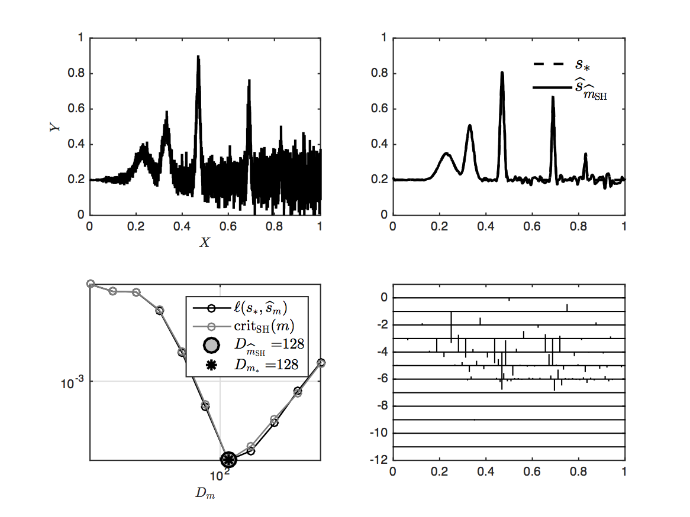

## Optimal model selection in heteroscedastic regression

This is the code to reproduce all the experiments presented in the paper

**F. Navarro and A. Saumard
 
[Slope heuristics and V-Fold model selection in heteroscedastic regression using strongly localized bases](https://arxiv.org/abs/1505.05654)
 
To appear in [ESAIM: Probability and Statistics](http://www.esaim-ps.org/)**

### Requirements
* [Wavelab](http://statweb.stanford.edu/~wavelab/)

Copyright (c) 2017 Fabien Navarro and Adrien Saumard
